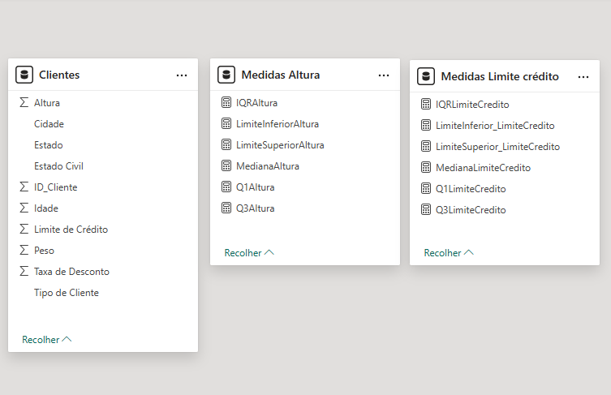
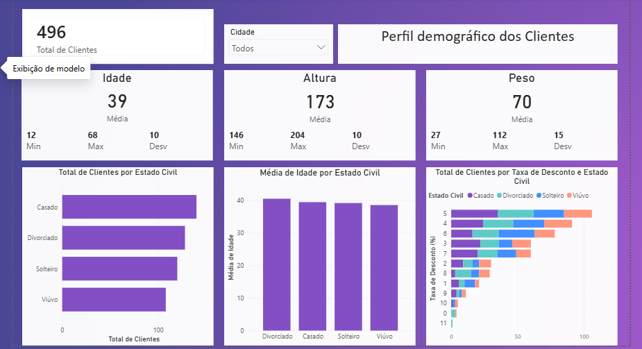
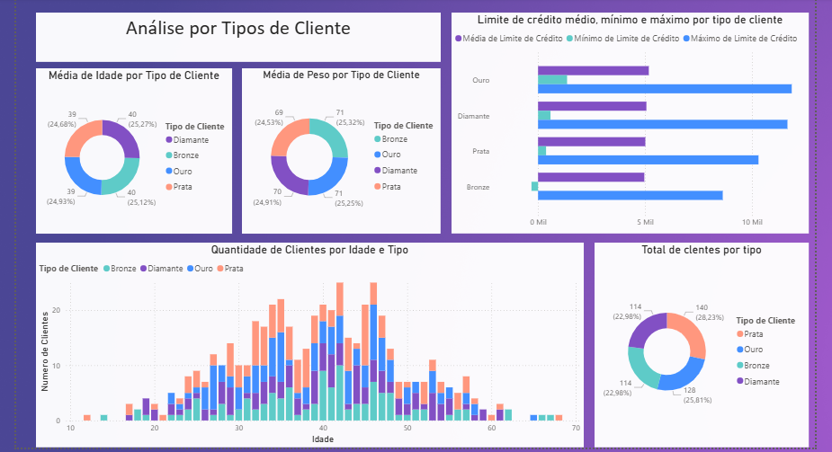
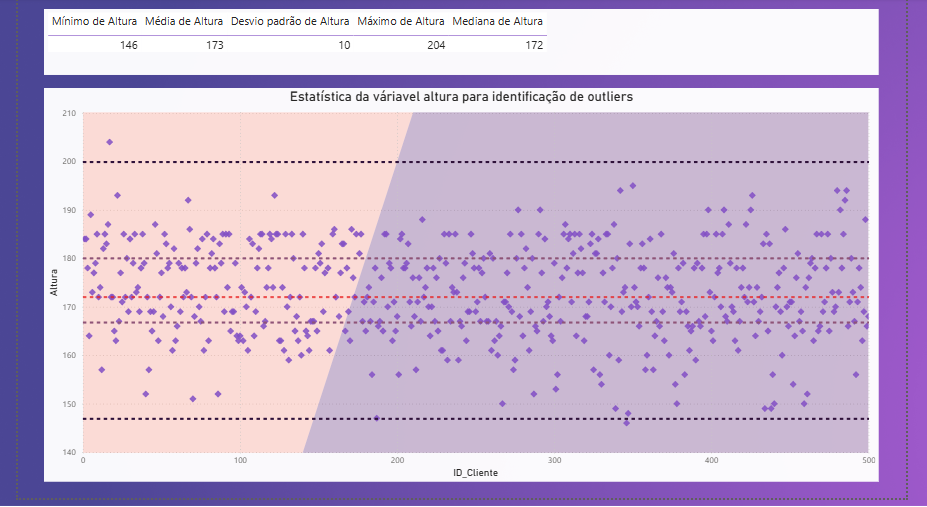
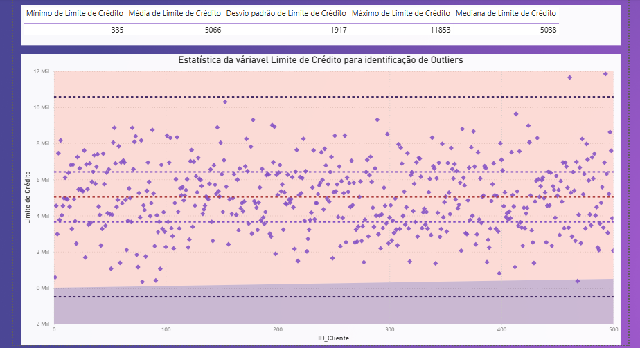

#👥 **Dashboard de Análise de Perfil de Clientes**

## 📖 Sobre o projeto

Este projeto apresenta um dashboard de análise de clientes desenvolvido no Power BI Desktop, com foco no perfil demográfico, segmentação por categoria e identificação de outliers na base de dados.
O painel reúne indicadores estratégicos sobre idade, altura, peso, estado civil, taxa de desconto e limite de crédito, permitindo uma visão completa do perfil da base de clientes, além de evidenciar o processo de tratamento e limpeza dos dados aplicado antes da análise.


---

## 🎯 Objetivos


* Traçar o perfil demográfico da base de clientes.
* Analisar a distribuição por estado civil e taxa de desconto.
* Segmentar os clientes por tipo/categoria (Bronze, Prata, Ouro, Diamante).
* Comparar idade, peso e limite de crédito entre as categorias de cliente.
* Identificar outliers nas variáveis Altura e Limite de Crédito.
* Garantir a qualidade e consistência da base de dados utilizada na análise.

## 📊 Funcionalidades do Dashboard

📌 Página 1 — Perfil Demográfico dos Clientes
Visão geral da base com indicadores de:

* 👥 Total de Clientes
* 🎂 Idade (média, mínimo, máximo, desvio padrão)
* 📏 Altura (média, mínimo, máximo, desvio padrão)
* ⚖️ Peso (média, mínimo, máximo, desvio padrão)
* 💍 Total de Clientes por Estado Civil
* 📊 Média de Idade por Estado Civil
* 💸 Total de Clientes por Taxa de Desconto e Estado Civil
* 🔎 Filtro interativo por Cidade

📌 Página 2 — Análise por Tipo de Cliente
Segmentação da base por categoria de cliente, permitindo comparar:

* Média de Idade por Tipo de Cliente
* Média de Peso por Tipo de Cliente
* Limite de Crédito médio, mínimo e máximo por Tipo de Cliente
* Quantidade de Clientes por Idade e Tipo
* Total de Clientes por Tipo (Bronze, Prata, Ouro, Diamante)

📌 Página 3 — Identificação de Outliers em Altura
Análise estatística da variável Altura utilizando o método IQR (intervalo interquartil), com:

* Estatísticas descritivas (mínimo, média, mediana, máximo, desvio padrão)
* Gráfico de dispersão com limites superior e inferior para identificação visual de outliers

📌 Página 4 — Identificação de Outliers no Limite de Crédito
Análise estatística da variável Limite de Crédito utilizando o método IQR, com:

* Estatísticas descritivas (mínimo, média, mediana, máximo, desvio padrão)
* Gráfico de dispersão com limites superior e inferior para identificação visual de outliers
* Identificação e tratamento de valores inconsistentes (ex.: limite de crédito negativo)

🛠️ Ferramentas Utilizadas

* Power BI Desktop
* Power Query
* DAX
* Modelagem de Dados
* Identificação de Outliers (Método IQR)
* Segmentações
* Visualizações Interativas

📌 Indicadores Monitorados

* Total de Clientes
* Idade, Altura e Peso (média, mínimo, máximo, desvio padrão)
* Distribuição por Estado Civil
* Taxa de Desconto por Estado Civil
* Distribuição por Tipo de Cliente
* Limite de Crédito por Tipo de Cliente
* Outliers em Altura
* Outliers em Limite de Crédito

💡 Principais Insights
Este dashboard possibilita:

* Compreender o perfil demográfico geral da base de clientes.
* Avaliar como a taxa de desconto se relaciona com o estado civil.
* Identificar diferenças de limite de crédito entre as categorias de cliente.
* Detectar e tratar valores inconsistentes, como limites de crédito negativos.
* Garantir uma base de dados confiável para análises futuras.

📂 Estrutura do Projeto

```
PowerBI-Dashboard-Clientes/
│
├── Dashboard_Clientes.pbix
├── README.md
├── dataset
│   └── Base_Clientes.xlsx
│
└── screenshots
    ├── modelagem.png
    ├── perfil_demografico.png
    ├── analise_tipocliente.png
    ├── outliers_altura.png
    └── outliers_credito.png
```

📷 Dashboard

**Modelagem dos Dados**


**Página 1 — Perfil Demográfico dos Clientes**


**Página 2 — Análise por Tipo de Cliente**


**Página 3 — Identificação de Outliers em Altura**


**Página 4 — Identificação de Outliers no Limite de Crédito**


🚀 Como visualizar

1. Faça o download do arquivo `.pbix`.
2. Abra o projeto utilizando o Power BI Desktop.
3. Navegue pelas páginas e utilize os filtros para explorar os indicadores.

🎓 Competências Demonstradas
Durante o desenvolvimento deste projeto foram aplicados conceitos de:

* ✔️ Business Intelligence (BI)
* ✔️ Limpeza e Tratamento de Dados
* ✔️ Identificação de Outliers (Método IQR)
* ✔️ Modelagem de Dados
* ✔️ Desenvolvimento de Medidas em DAX
* ✔️ Transformação de Dados com Power Query
* ✔️ Storytelling com Dados
* ✔️ Visualização Interativa
* ✔️ Análise Estatística Descritiva

👨‍💻 Autor
José Rafael Santos Pereira
Desenvolvendo projetos práticos | Power BI | SQL | Python | Business Intelligence

GitHub: https://github.com/ZeRafaSp/

LinkedIn: https://www.linkedin.com/in/rafaelsantospereirarsp/


